# LearnScope Platform Admin Guide

*A complete reference for platform administrators — the small number of
LearnScope staff who moderate the shared catalogue, manage provider and
employer organisations, and keep the skill library healthy across every
learner on the platform.*

---

## Who this guide is for

This guide is written for **platform admins** — not learners, not provider
staff, not employer admins. If you're looking for how a *learner* tracks a
skill or a *provider* submits a course, see the learner-facing help centre
and the Provider Console guide instead. Everything here lives behind one
gate: your account must have a row in `platform_admins`, granted by an
existing platform admin.

Two important ideas run through the whole console and are worth holding in
mind before you touch anything:

- **The learner owns their record.** As a platform admin you can see
  aggregate statistics and moderate shared/public content (the course
  catalogue, the skill library, provider organisations), but you do not get
  a general-purpose window into a learner's private data. Where the console
  *does* show you one learner's account in full (the [user detail
  page](#3-managing-users)), that's a deliberate, narrow exception for
  support and moderation — not a precedent for browsing learner data
  elsewhere.
- **Almost everything here is shared, reusable data.** Skills, courses, and
  tags are catalogued once and referenced everywhere, rather than copied
  per learner or per organisation. When you edit a skill's category or
  reject a course, you're editing the one shared record everyone points at
  — which is powerful, but means changes are more consequential than they'd
  be in a system with per-user copies.

---

## Contents

1. [Getting into the console](#1-getting-into-the-console)
2. [Overview — your daily work queue](#2-overview--your-daily-work-queue)
3. [Managing users](#3-managing-users)
4. [Managing provider organisations](#4-managing-provider-organisations)
5. [Managing employers](#5-managing-employers)
6. [Moderating the course catalogue](#6-moderating-the-course-catalogue)
7. [Managing the skill library](#7-managing-the-skill-library)
8. [Managing tags](#8-managing-tags)
9. [Activity log — the audit trail](#9-activity-log--the-audit-trail)
10. [Configuring the first-login journey](#10-configuring-the-first-login-journey)
11. [Appendix: roles, permissions, and the domain model](#11-appendix-roles-permissions-and-the-domain-model)

---

## 1. Getting into the console

Platform admin access isn't a role you can grant yourself from the UI —
there's no "make me an admin" button anywhere in the product, by design.
The **first** platform admin for an environment is granted directly in the
database; every admin after that is granted by an *existing* admin adding a
row to the `platform_admins` table (currently a database-level operation,
not a console workflow — see the note in
[§11](#11-appendix-roles-permissions-and-the-domain-model)).

Once your account has that grant, a **Platform console** entry point
appears in your account menu (top-right of any page, next to your avatar),
alongside "Switch to learner mode" so you can move between your own
learner account and the admin console without signing out.

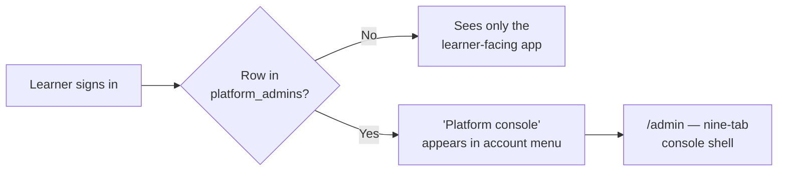
```mermaid
flowchart LR
    A["Learner signs in"] --> B{"Row in\nplatform_admins?"}
    B -- "No" --> C["Sees only the\nlearner-facing app"]
    B -- "Yes" --> D["'Platform console'\nappears in account menu"]
    D --> E["/admin — nine-tab\nconsole shell"]
```

Every admin page shares the same shell: a **Platform console** header and a
row of tabs — *Overview, Users, Providers, Employers, Courses, Skill
library, Tags, Activity log, Settings*. You'll see this same tab strip on
every screenshot in this guide.

---

## 2. Overview — your daily work queue

`/admin` — the landing page — is deliberately not a vanity dashboard of
platform-wide metrics. It's a **work queue**: four tiles, each a single
count of something that needs a decision from you, and each tile links
straight to the pre-filtered list where you'd act on it.

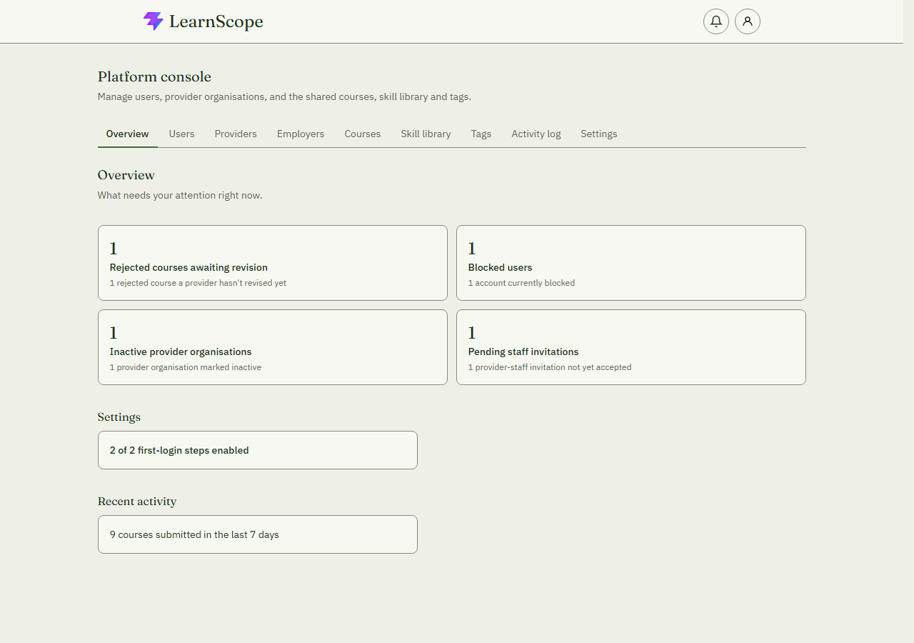

| Tile | What it counts | Where it links |
|---|---|---|
| Rejected courses awaiting revision | Rejected courses a provider hasn't resubmitted | Courses, pre-filtered to `rejected` |
| Blocked users | Accounts currently blocked | Users, pre-filtered to `blocked` |
| Inactive provider organisations | Organisations marked inactive | Providers, pre-filtered to `inactive` |
| Pending staff invitations | Provider-staff invites not yet accepted | Providers (no sharper filter exists for this one) |

Below the tiles, two more panels: a **Settings** summary (how many
first-login wizard steps are currently enabled — with a red warning if
you've disabled every step, since that silently skips onboarding for every
new learner) and **Recent activity** (how many courses were submitted for
review in the last 7 days).

> **Design note:** when every tile reads zero, the whole panel collapses to
> a single "Nothing needs your attention right now" message rather than
> showing four zeroes. If you're staring at four empty tiles instead, check
> you're not looking at a fresh/test environment with no data in it yet.

---

## 3. Managing users

`/admin/users` is the full roster of every account on the platform — the
one place a platform admin's reach extends to every learner, not just
shared/catalogue data.

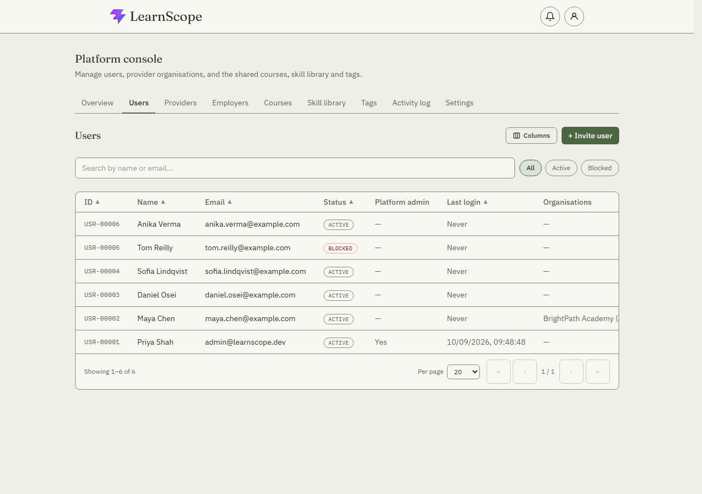

**What you can do here:**

- **Search and filter** by name/email and by account status (All / Active
  / Blocked) — the filters live in the URL, so a filtered link is
  shareable and survives a page refresh.
- **Customize columns** — the *Columns* button lets you show, hide, and
  reorder columns; your preference is remembered per-browser.
- **Invite a user** — `+ Invite user` sends a Supabase auth invite email
  directly; it doesn't attach them to any organisation (see
  [§4](#4-managing-provider-organisations) for that).
- **Block / unblock** — a blocked account can't sign in until reactivated.
  You can't block your own account (the button is disabled on your own
  row) — there's always a way back in.
- **Delete** — permanent, and gated behind a linkage preview: before you
  can confirm, the dialog shows exactly what's attached to the account
  (skill count, course count, experience entries, connections,
  organisation memberships) and blocks the delete entirely if this is the
  **last remaining platform admin**. You must type `DELETE` to confirm.

### The user detail page

Clicking any name or email opens `/admin/users/:id` — a **read-only, full
account view**: profile basics, every skill they track (with the same
growth-ring visual they'd see on their own skill page), every course,
every experience entry, and their connections.

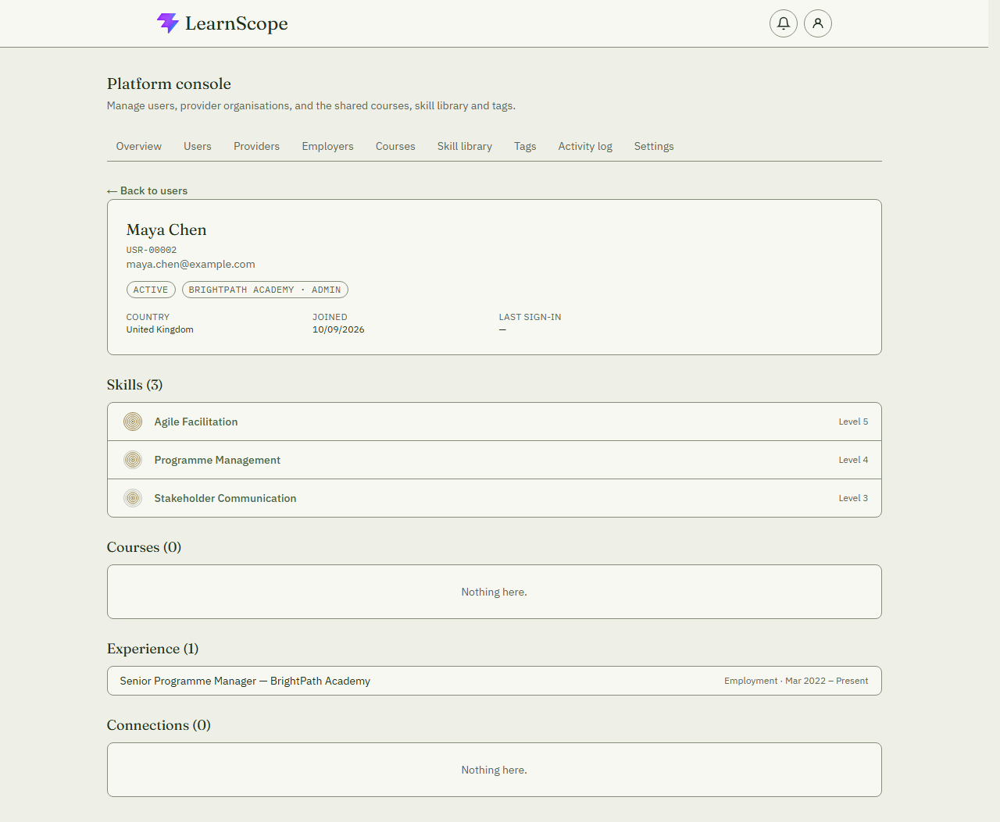

This page is intentionally the **one deliberate exception** to "platform
admins don't see private learner data" — it exists for support and
moderation (e.g. investigating a dispute, or checking what a delete would
remove), not as a general analytics surface. There's no equivalent
"browse everyone's skills" page anywhere else in the console; skill-level
statistics elsewhere (see [§7](#7-managing-the-skill-library)) are
always anonymized counts, never a named list.

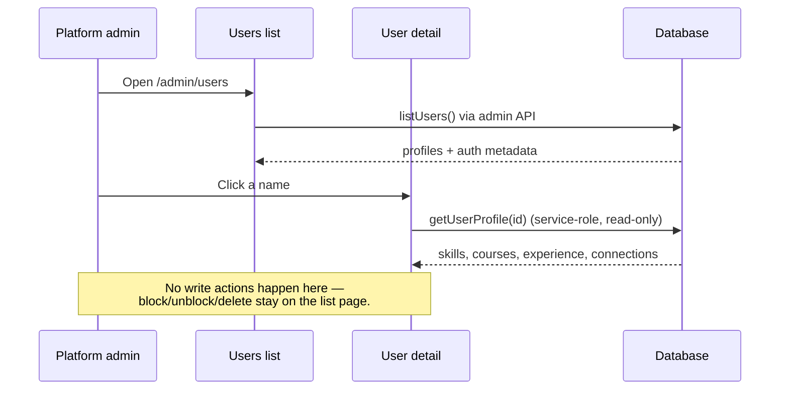
```mermaid
sequenceDiagram
    participant Admin as Platform admin
    participant Users as Users list
    participant Detail as User detail
    participant DB as Database

    Admin->>Users: Open /admin/users
    Users->>DB: listUsers() via admin API
    DB-->>Users: profiles + auth metadata
    Admin->>Detail: Click a name
    Detail->>DB: getUserProfile(id) (service-role, read-only)
    DB-->>Detail: skills, courses, experience, connections
    Note over Admin,Detail: No write actions happen here —<br/>block/unblock/delete stay on the list page.
```

---

## 4. Managing provider organisations

`/admin/providers` is where training providers — the organisations whose
staff author courses in the Provider Console — are created and moderated.

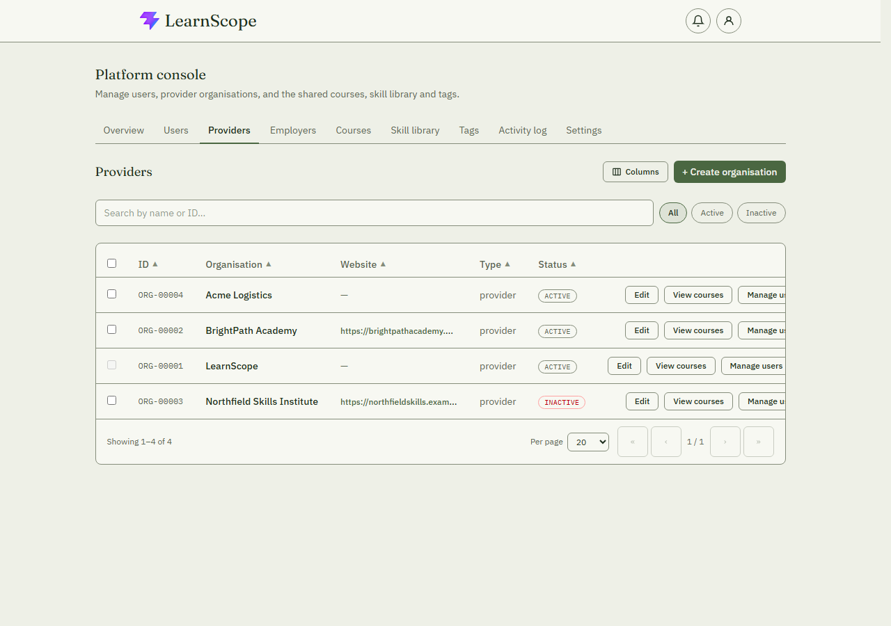

**Creating an organisation** is a single form (`+ Create organisation`,
name only) — everything else (website, logo, brand colours, public
profile) is filled in later, either by you via *Edit* or by the
organisation's own admin staff once they have access.

**Activate / Suspend**, individually or in bulk via row checkboxes, is how
you gate an organisation's access without deleting anything: a suspended
organisation's staff lose console access, but nothing about their data is
touched, and reactivating restores it instantly.

**Manage users** expands an inline panel — no separate page — where you
invite staff by email as either **Admin** (full organisation management)
or **Trainer** (course authoring only), and see who's active versus still
pending their invite.

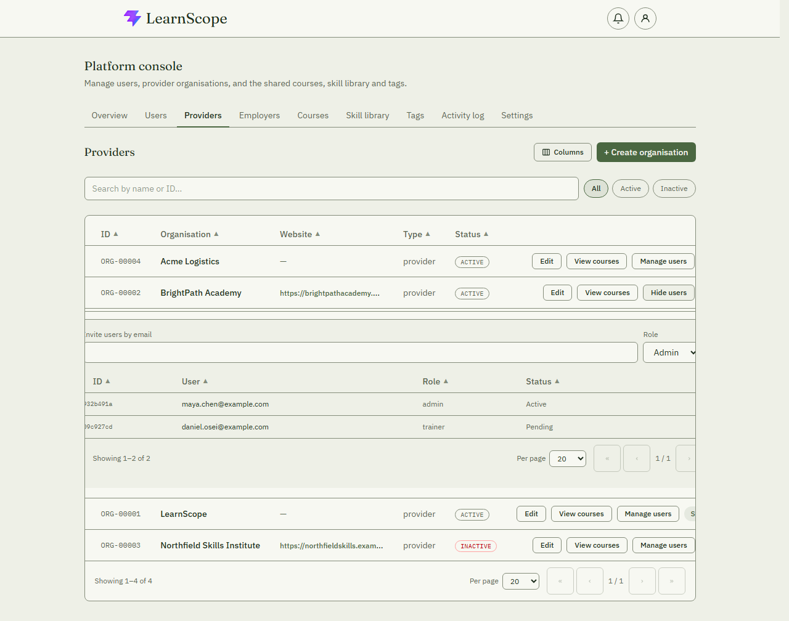

> **Note the pending trainer row.** An invited-but-not-yet-accepted staff
> member shows up immediately with a **Pending** status — they don't
> silently disappear until accepted. If someone says they "never got
> access," this is the first place to check.

**View courses** is a shortcut into the [course catalogue](#6-moderating-the-course-catalogue),
pre-filtered to that one organisation — useful when you're already looking
at a provider and want to see everything they've submitted.

---

## 5. Managing employers

`/admin/employers` is the newest and smallest domain concept in the
console: an **employer** is a company running its own in-house learning
program — assigning courses to its workforce — as distinct from a
**training provider**, which authors courses for others to take.

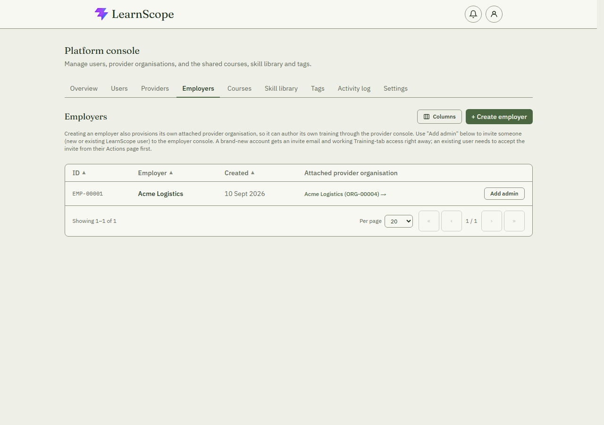

Creating an employer does two things atomically: it creates the employer
record *and* provisions an attached provider organisation the employer can
use to author its own internal training, without you needing a second
trip to Providers. You'll see that attached organisation appear in the
Providers list automatically (that's why "Acme Logistics" shows up in both
screenshots above).

**Add admin** is the only way to bootstrap access to a brand-new employer
— nothing else can reach the Employer Console's Learners/Training tabs,
which themselves require already being an employer admin. A brand-new
LearnScope account gets an invite email and working access immediately;
an existing user is added pending their own acceptance from their Actions
page.

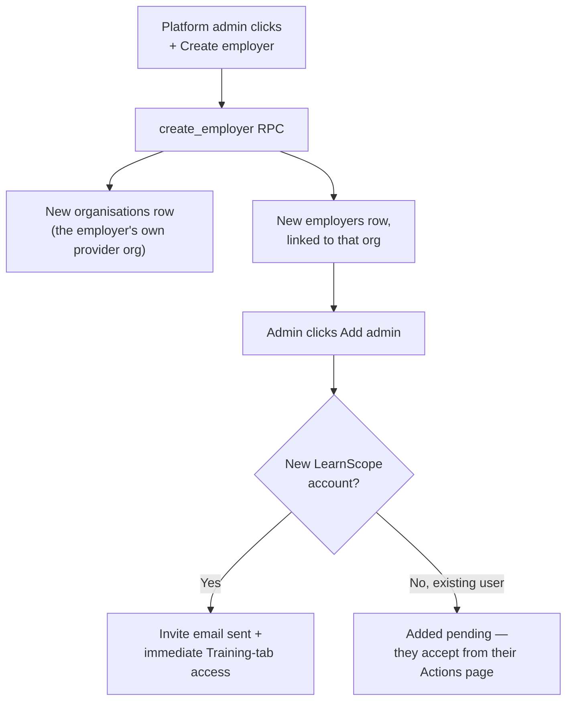
```mermaid
flowchart TD
    A["Platform admin clicks\n+ Create employer"] --> B["create_employer RPC"]
    B --> C["New organisations row\n(the employer's own provider org)"]
    B --> D["New employers row,\nlinked to that org"]
    D --> E["Admin clicks Add admin"]
    E --> F{"New LearnScope\naccount?"}
    F -- Yes --> G["Invite email sent +\nimmediate Training-tab access"]
    F -- No, existing user --> H["Added pending —\nthey accept from their Actions page"]
```

---

## 6. Moderating the course catalogue

`/admin/catalogue` is the shared course catalogue across **every**
provider — this is the platform-wide moderation queue, distinct from a
single provider's own view of their own courses in the Provider Console.

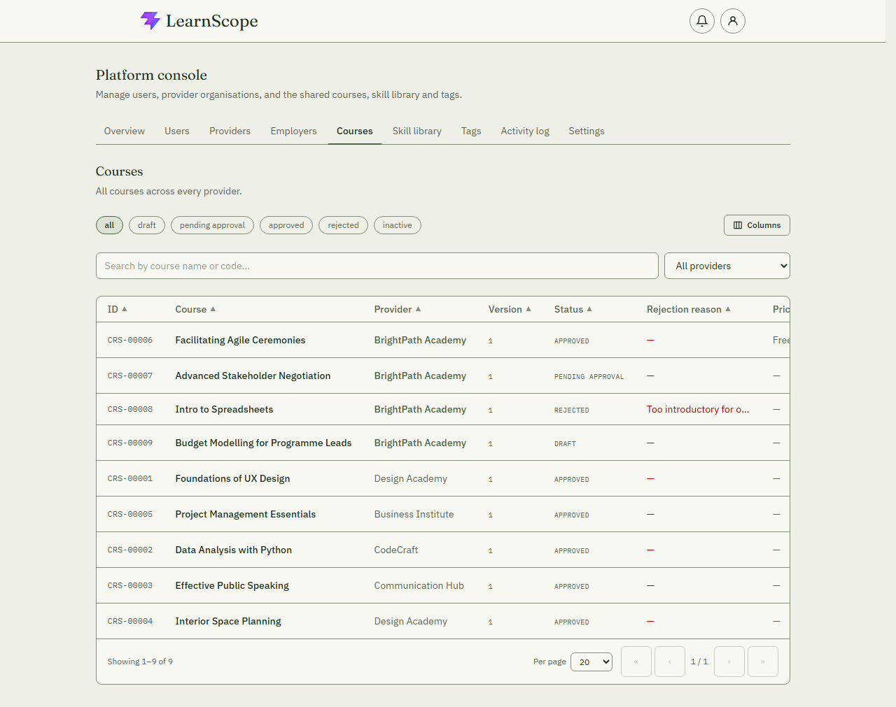

Every course carries a **moderation status** — this is the workflow the
whole page revolves around:

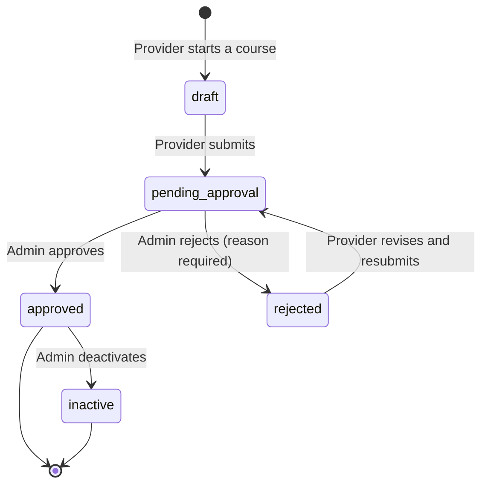
```mermaid
stateDiagram-v2
    [*] --> draft: Provider starts a course
    draft --> pending_approval: Provider submits
    pending_approval --> approved: Admin approves
    pending_approval --> rejected: Admin rejects (reason required)
    rejected --> pending_approval: Provider revises and resubmits
    approved --> inactive: Admin deactivates
    approved --> [*]
    inactive --> [*]
```

**Filters, search, and per-provider scoping** work the same way as the
Users list — status pills across the top, a text search, a provider
dropdown, and every filter combination is reflected in the URL.

**Rejecting** a course requires a reason — the *Confirm reject* button
stays disabled until you type one, and that reason is what the provider
sees on their end, plus what gets recorded to the [activity log](#9-activity-log--the-audit-trail).

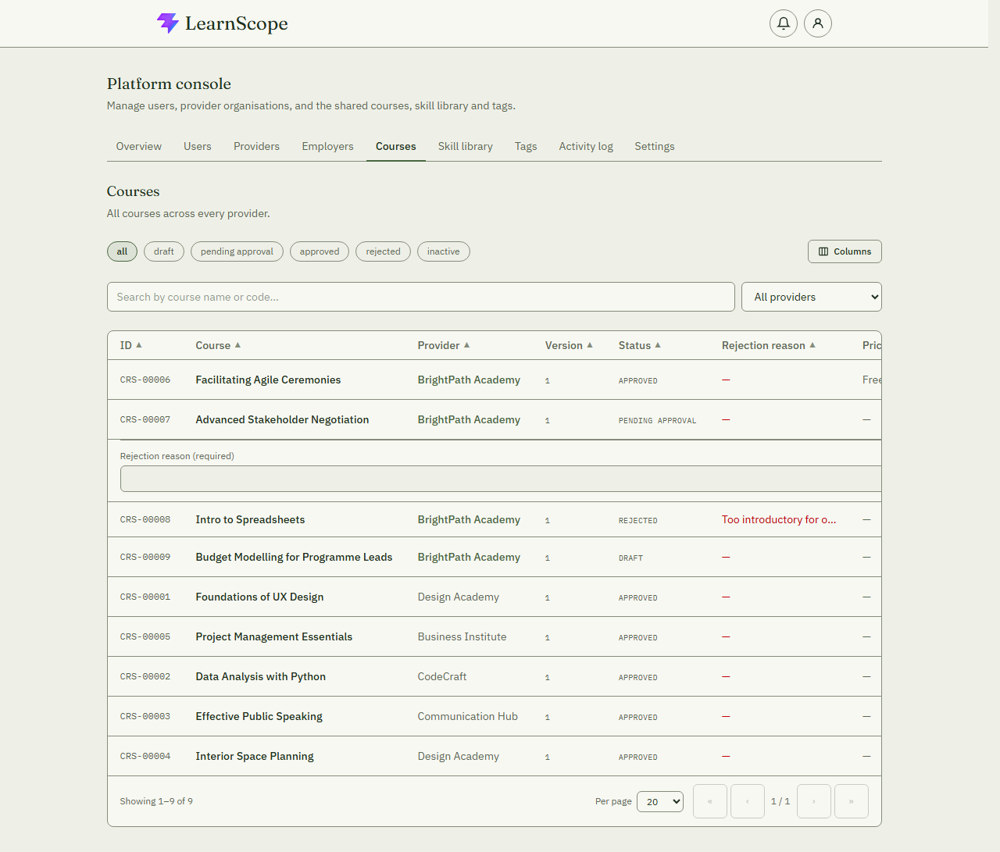

**Deactivating** an already-approved course removes it from learner-facing
catalogues without deleting the record — the same activate/deactivate
pattern used for organisations and skills throughout this console.

Two columns worth calling out specifically:

- **Participants** is a live count of how many learners have this exact
  course version in their own personal record — deliberately a *count
  only*. As a platform admin you have no standing access to see *which*
  learners those are from this list; that's each learner's own private
  data.
- **Destinations** shows which catalogues (e.g. the global catalogue) a
  course is currently published into — a course can be approved but not
  yet published anywhere, which is why you'll see some approved rows with
  no destination.

### Drilling into one course

Clicking a course name opens `/admin/catalogue/:id` — a read-only detail
view: full metadata, the skills it targets, its content structure grouped
by section, and its complete version history.

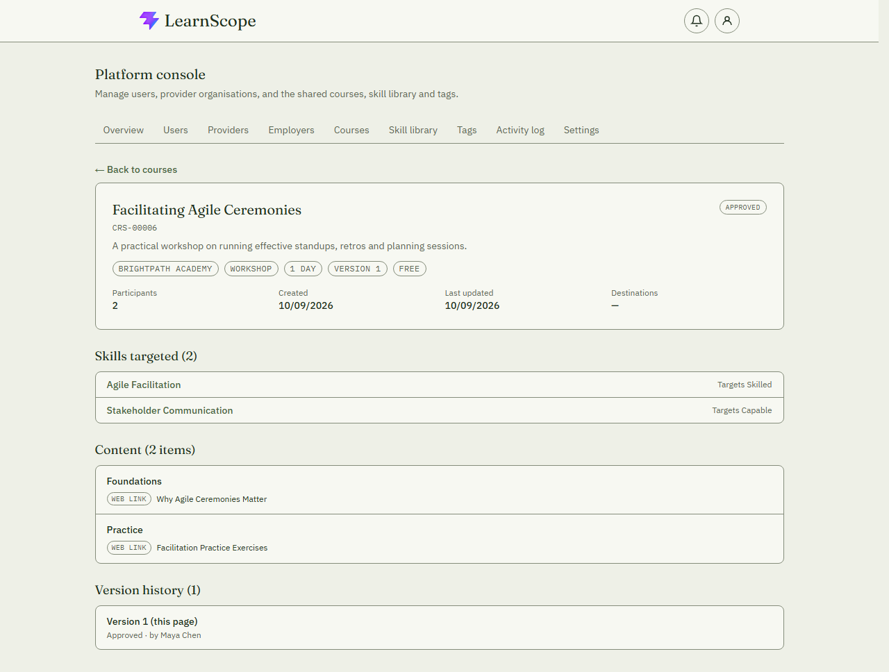

**Versioning** is why "version history" matters: once a course is
approved, editing it doesn't overwrite the live version — a provider
creates a new draft version, which goes through the same
draft → pending → approved cycle independently, while the currently-live
version keeps serving learners until the new one is approved. This page
is where you can see every version of a course's history in one place,
including who created and approved each one.

---

## 7. Managing the skill library

`/admin/skills` is the shared catalog of skill *definitions* — names,
categories, icons — that every learner's personal skill-tracking points
at. This is the single most-referenced shared concept in the product:
editing a skill here changes what every learner sees, everywhere that
skill appears.

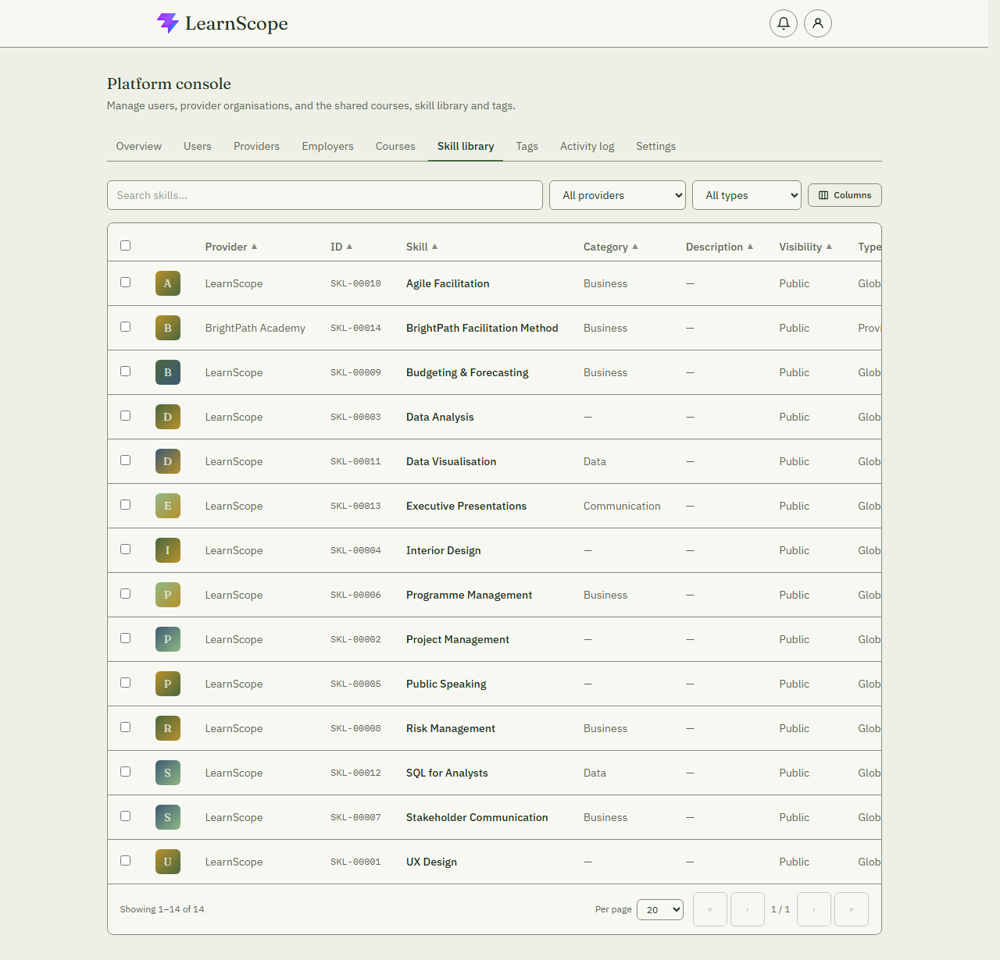

Every skill is exactly one of three types, shown in the **Type** column:

| Type | Meaning |
|---|---|
| **Global** | Shared platform-wide, visible and usable by any learner or organisation |
| **Provider** | Owned by one organisation, visible only within that organisation's context |
| **Personal** | A single learner's own private entry, never shown here at all (this page only lists public/provider skills) |

**Icons** are generated automatically the moment a skill exists — a
deterministic colour-and-initial pattern (the same approach used for
course-thumbnail placeholders), so nothing here is ever blank. A platform
admin or the skill's own provider can replace the generated icon with a
real uploaded image at any time from the skill's detail page.

**Filters and bulk actions** mirror the rest of the console: search,
filter by provider and by type, select rows via checkbox, and
activate/deactivate in bulk. Deactivating a skill doesn't delete it or
detach it from anyone already tracking it — it just stops it from being
offered to learners searching for a new skill to add.

### Skill detail: composite skills and promotion

Opening a skill shows its full detail: statistics (an anonymized,
count-only breakdown of how many learners sit at each level — never a
named list), knowledge-level guides, and — the two capabilities unique to
this page — **component skills** and **promote to global**.

**Composite skills** let a broad skill be defined as made up of other,
more specific skills in the library. This is versioned and
publish-gated: you build a **draft** component set, and it only affects
what learners see once you **publish** it — a learner's confirmed skill
level is never silently recalculated by editing components.

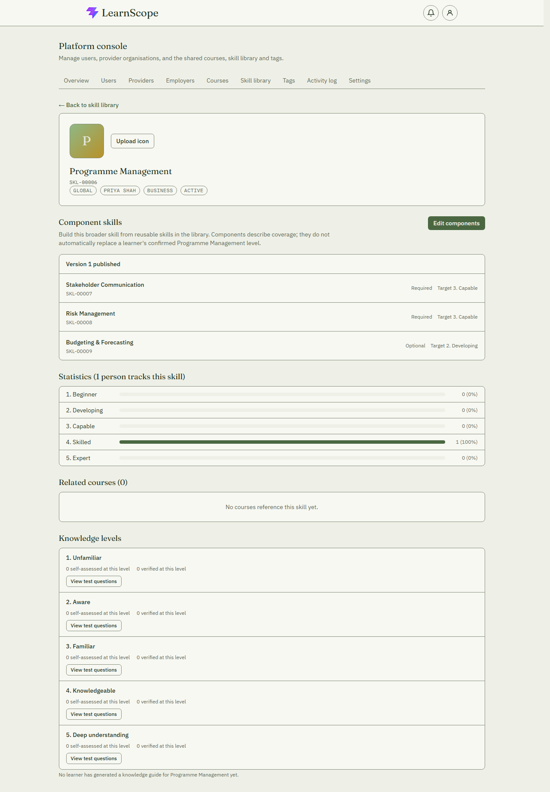

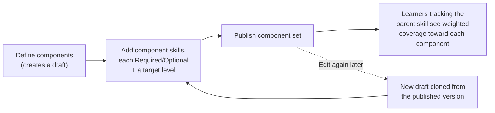
```mermaid
flowchart LR
    A["Define components\n(creates a draft)"] --> B["Add component skills,\neach Required/Optional\n+ a target level"]
    B --> C["Publish component set"]
    C --> D["Learners tracking the\nparent skill see weighted\ncoverage toward each component"]
    C -.->|"Edit again later"| E["New draft cloned from\nthe published version"]
    E --> B
```

**Promote to global** only appears on a **provider**-owned skill, and only
a platform admin can use it. It's the one-way action that turns an
organisation's private skill into a global one — instantly offerable by
*any* organisation, not just the one that created it. There's no "demote"
affordance in the UI on purpose: once other organisations may have
offered or built composite skills against it as global, reverting is a
much bigger decision than promoting was.

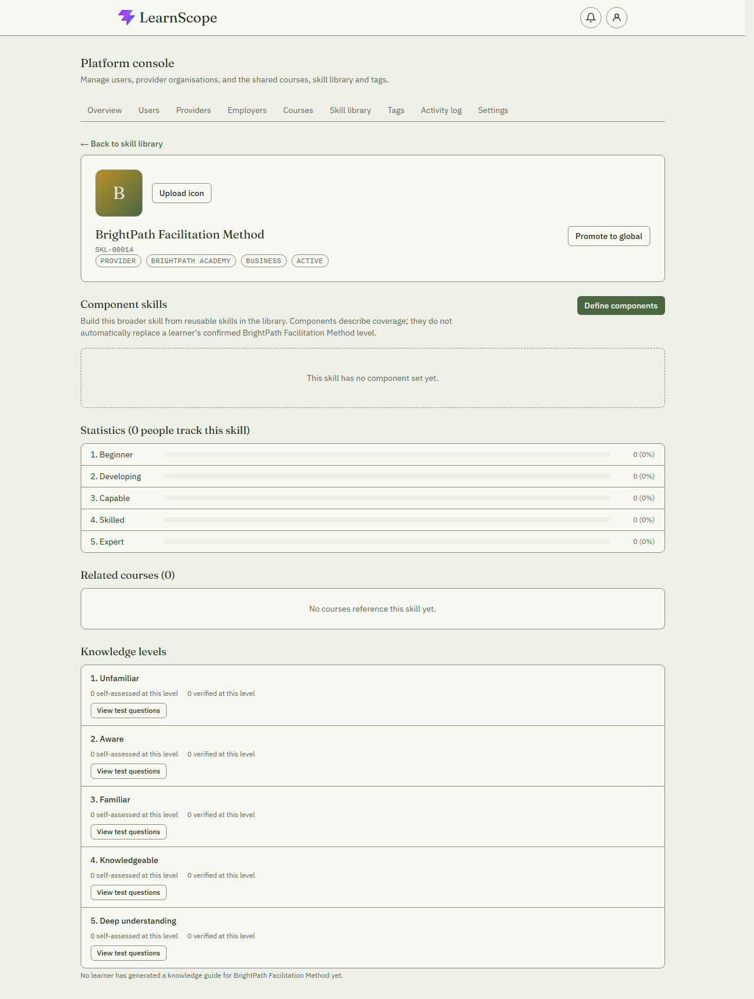

---

## 8. Managing tags

`/admin/tags` is the smallest page in the console: a flat list of the tags
learners and providers attach to skills and courses, with one moderation
action — **blacklist**.

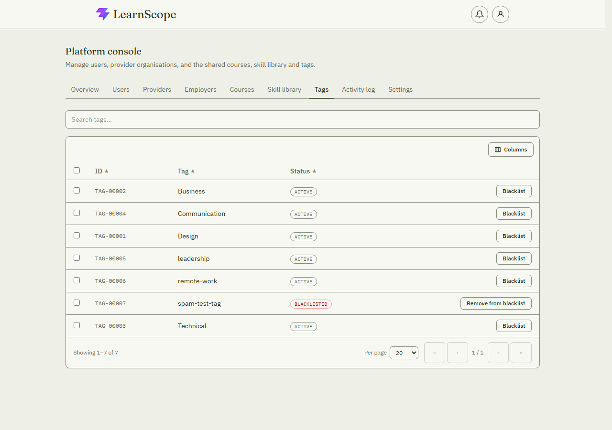

Blacklisting is soft — a blacklisted tag isn't deleted, it's just hidden
from future tag-suggestion flows so it stops being offered to new content,
while anything already tagged with it is untouched. Search, bulk-select,
and column customization all work the same way as every other list in
this console.

---

## 9. Activity log — the audit trail

`/admin/activity` is a flat, most-recent-first record of every
significant moderation action taken across the platform: course
approvals/rejections, user blocks, tag blacklisting, organisation
activation/suspension, and staff/membership changes.

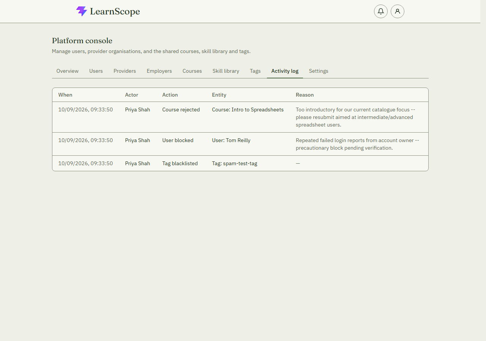

This is deliberately **not** a general mutation log — it only records the
curated set of high-impact actions listed above, not every read or minor
edit. If you need to know *who rejected this course and why* or *who
blocked this account*, this is the first place to look; each entry
carries the actor, a human-readable action and entity description, and
the reason given at the time (where one was required, like a course
rejection).

---

## 10. Configuring the first-login journey

`/admin/onboarding` — the **Settings** tab — controls the step-by-step
wizard every new learner sees immediately after signing up: importing a
CV, choosing skills to learn, and so on.

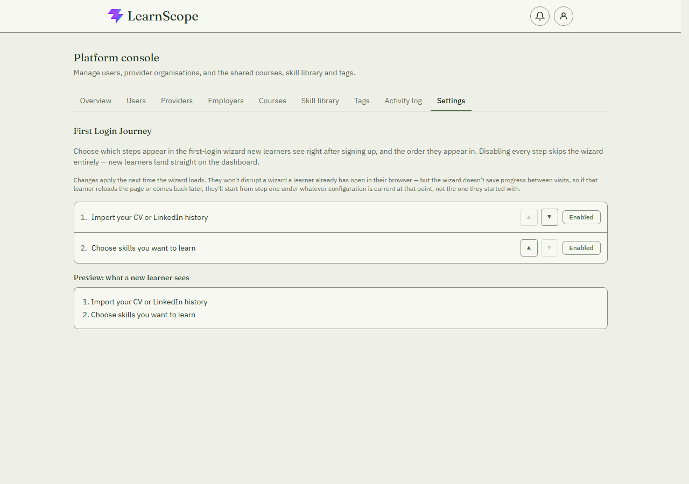

You can **enable/disable** each step and **reorder** them with the ▲/▼
controls — the preview panel at the bottom always reflects exactly what a
brand-new learner will see next. Two things worth knowing before you
touch this:

- **Disabling every step skips the wizard entirely** — new learners land
  straight on their dashboard with no onboarding at all. The page (and the
  Overview tile) both warn you loudly in red if you end up in this state.
- **Changes don't retroactively affect a wizard already open** in a
  learner's browser tab — but the wizard also doesn't save progress
  between visits, so if that learner reloads or comes back later, they
  restart from step one under whatever configuration is current *then*,
  not the one they started under.

---

## 11. Appendix: roles, permissions, and the domain model

### How access is actually enforced

Every admin page and every admin data-access function is gated the same
way, at the database level via Postgres Row-Level Security (RLS) — the
console's own routing (`PlatformAdminRoute`) hides the UI from
non-admins, but the *real* boundary is enforced regardless of which
screen you're looking at:

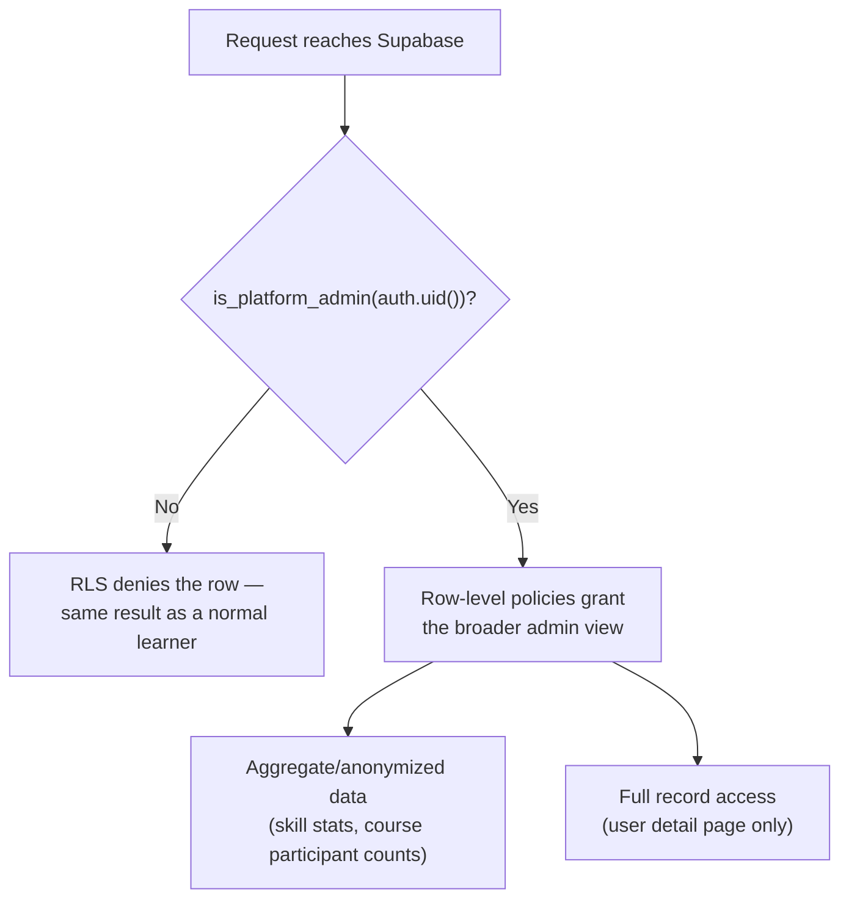
```mermaid
flowchart TD
    A["Request reaches Supabase"] --> B{"is_platform_admin(auth.uid())?"}
    B -- No --> C["RLS denies the row —\nsame result as a normal learner"]
    B -- Yes --> D["Row-level policies grant\nthe broader admin view"]
    D --> E["Aggregate/anonymized data\n(skill stats, course participant counts)"]
    D --> F["Full record access\n(user detail page only)"]
```

There is currently **no in-console way to grant or revoke platform admin
access** — the very first admin, and any admin added after, is granted by
inserting directly into the `platform_admins` table. This is a deliberate
gap, not an oversight: platform admin is the single most powerful role in
the system, and until a reviewed in-console workflow exists for granting
it, that decision stays a deliberate, out-of-band action rather than a
routine console click.

### The shared domain model this console manages

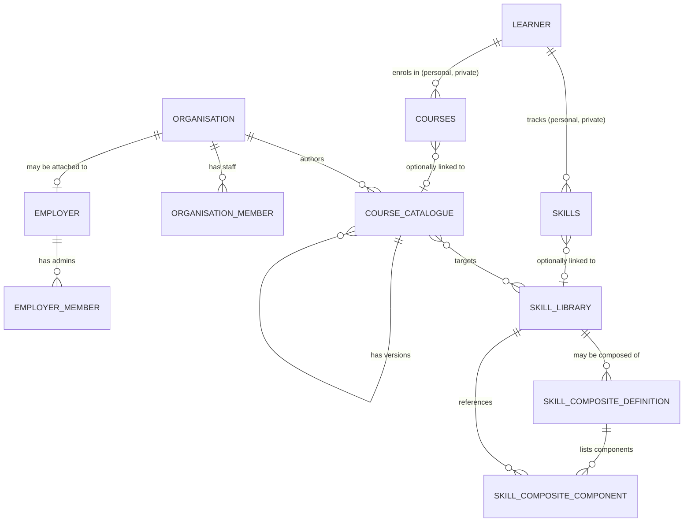
```mermaid
erDiagram
    ORGANISATION ||--o{ COURSE_CATALOGUE : "authors"
    ORGANISATION ||--o{ ORGANISATION_MEMBER : "has staff"
    ORGANISATION ||--o| EMPLOYER : "may be attached to"
    EMPLOYER ||--o{ EMPLOYER_MEMBER : "has admins"
    SKILL_LIBRARY ||--o{ SKILL_COMPOSITE_DEFINITION : "may be composed of"
    SKILL_COMPOSITE_DEFINITION ||--o{ SKILL_COMPOSITE_COMPONENT : "lists components"
    SKILL_COMPOSITE_COMPONENT }o--|| SKILL_LIBRARY : "references"
    COURSE_CATALOGUE }o--o{ SKILL_LIBRARY : "targets"
    COURSE_CATALOGUE ||--o{ COURSE_CATALOGUE : "has versions"
    LEARNER ||--o{ SKILLS : "tracks (personal, private)"
    SKILLS }o--o| SKILL_LIBRARY : "optionally linked to"
    LEARNER ||--o{ COURSES : "enrols in (personal, private)"
    COURSES }o--o| COURSE_CATALOGUE : "optionally linked to"
```

The pattern repeated everywhere in this console: **shared, reusable
definitions** (organisations, courses, skills, tags) versus **private,
per-learner records** (a learner's own tracked skills and courses) that
*reference* the shared definitions without duplicating them. As a platform
admin, you moderate the shared layer; you almost never touch the private
layer directly — the one deliberate exception being the read-only user
detail page in [§3](#3-managing-users).

### Quick reference: where to go for what

| I need to... | Go to |
|---|---|
| Block or delete an account | [Users](#3-managing-users) |
| See everything on one learner's account | [User detail](#3-managing-users) |
| Onboard a new training provider | [Providers](#4-managing-provider-organisations) |
| Set up a company running its own in-house training | [Employers](#5-managing-employers) |
| Approve, reject, or deactivate a course | [Courses](#6-moderating-the-course-catalogue) |
| See a course's full content, skills, and version history | [Course detail](#6-moderating-the-course-catalogue) |
| Edit a skill's category, icon, or active status | [Skill library](#7-managing-the-skill-library) |
| Build a skill out of other skills | [Skill detail → composite skills](#skill-detail-composite-skills-and-promotion) |
| Make a provider's private skill available platform-wide | [Skill detail → promote to global](#skill-detail-composite-skills-and-promotion) |
| Stop a bad tag from being suggested again | [Tags](#8-managing-tags) |
| Find out who did something and why | [Activity log](#9-activity-log--the-audit-trail) |
| Change what new learners see when they sign up | [Settings / First Login Journey](#10-configuring-the-first-login-journey) |
